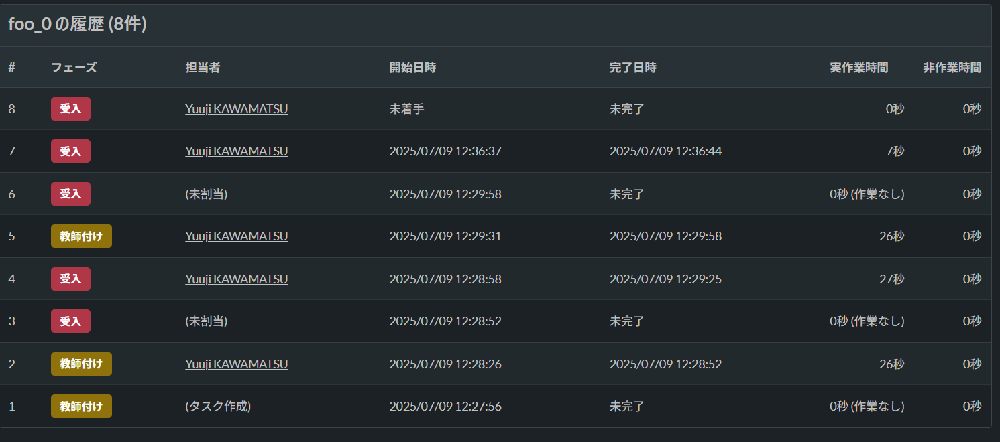

==========================================
annotation dump
==========================================

Description
=================================
`annofabcli annotation restore <../annotation/restore.html>`_ コマンドに読み込ませることができるアノテーション情報を出力します。
アノテーションのバックアップ目的で利用することを想定しています。

Examples
=================================

基本的な使い方
--------------------------

``--task_id`` に出力対象のタスクのtask_idを指定して、 ``--output_dir`` に出力先ディレクトリのパスを指定してください。

.. code-block::

    $ annofabcli annotation dump --project_id prj1 --task_id file://task.txt --output_dir backup-dir/

出力先ディレクトリの構成は以下の通りです。
``{input_data_id}.json`` のフォーマットは、https://annofab.com/docs/api/#operation/getEditorAnnotation APIのレスポンス ``AnnotationV2Output`` と同じです。

.. code-block::

    ルートディレクトリ/
    ├── {task_id}/
    │   ├── {input_data_id}.json
    │   ├── {input_data_id}/
    │          ├── {annotation_id}............ 塗りつぶしPNG画像

アノテーション情報のリストアは、 `annofabcli annotation restore <../annotation/restore.html>`_ コマンドで実現できます。

.. code-block::

    $ annofabcli annotation restore --project_id prj1 --annotation backup-dir/

.. warning::

    ``annotation dump`` コマンドの出力結果は、``annotation restore`` コマンドに読み込ませることを目的として作られています。

    ``annotation dump`` コマンドの出力結果であるJSONの構造は、現在 ``AnnotationV2Output`` 形式ですが、WebAPIの変更により今後変更する可能性はあります。
    ``annotation dump`` コマンドの出力結果であるJSONの構造に直接依存したプログラムを作成する場合は、ご注意ください。

過去のアノテーション情報をダンプする
----------------------------------------------------
``--task_history_index`` を指定すると、該当するタスク履歴で付与されたアノテーション情報をダンプできます。

たとえばタスク履歴が以下のような場合に ``--task_history_index 1`` （0始まり）を指定すると、2番目（1始まり）のタスク履歴の完了日時である ``2025/07/09 12:28:52`` 時点のアノテーション情報をダンプします。

.. warning::

    過去のアノテーション情報は30日間しか保存されません。
    30日より前に保存されたアノテーション情報をダンプしようとした場合、アノテーションの結果（ ``details`` 配下）は0件の状態でダンプされます。
    

Usage Details
=================================

.. argparse::
    :ref: annofabcli.annotation.dump_annotation.add_parser
    :prog: annofabcli annotation dump
    :nosubcommands:
    :nodefaultconst:

