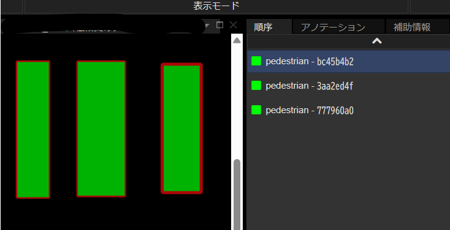
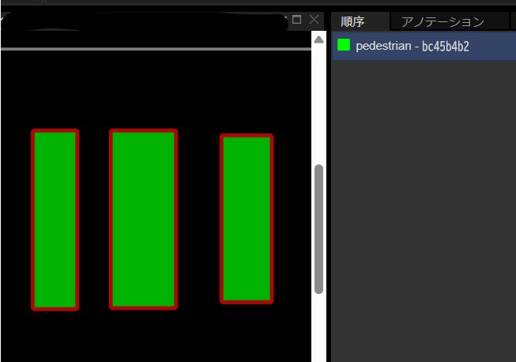

==========================================
annotation merge_segmentation
==========================================

Description
=================================
複数の塗りつぶしアノテーションを1つにまとめます。
ラベルの種類を「塗りつぶし（インスタンスセグメンテーション）」から「塗りつぶしv2（セマンティックセグメンテーション）」に変更する場合などに有用です。

Examples
=================================

以下のコマンドは、複数の ``road`` ラベルの塗りつぶしアノテーションを1つにまとめます。

.. code-block::

    $ annofabcli annotation merge_segmentation --project_id prj1 --task_id task1 --label_name road

1つにまとめる際、最前面にある塗りつぶしアノテーションが更新され、それ以外の塗りつぶしアノテーションは削除されます。

    
    コマンドの実行前の状態。「pedestrian」ラベルの塗りつぶしアノテーションが3つあります。

    

    
    コマンドの実行前の状態。「pedestrian」ラベルの塗りつぶしアノテーションが1つにまとめらます。最前面にあった「bc45b4b2」アノテーションが更新され、残りは削除されます。
    

Usage Details
=================================

.. argparse::
    :ref: annofabcli.annotation.merge_segmentation.add_parser
    :prog: annofabcli annotation merge_segmentation
    :nosubcommands:
    :nodefaultconst:

