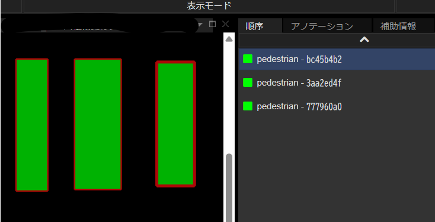
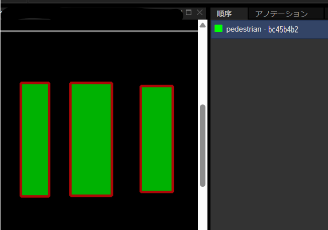

==========================================
annotation merge_segmentation
==========================================

Description
=================================
複数の塗りつぶしアノテーションを1つにまとめます。
ラベルの種類を「塗りつぶし（インスタンスセグメンテーション）」から「塗りつぶしv2（セマンティックセグメンテーション）」に変更する場合などに有用です。
オーナーロールまたはチェッカーロールを持つユーザーが実行できます。

Examples
=================================

以下のコマンドは、複数の ``road`` ラベルの塗りつぶしアノテーションを1つにまとめます。

.. code-block::

    $ annofabcli annotation merge_segmentation --project_id prj1 --task_id task1 --label_name road

1つにまとめる際、最前面にある塗りつぶしアノテーションが更新され、それ以外の塗りつぶしアノテーションは削除されます。

デフォルトでは、休憩中状態のタスクはアノテーションの更新をスキップします。
休憩中状態のタスクも更新する場合は、 ``--include_break_task`` を指定してください。

完了状態のタスクを更新するには、オーナーロールで ``--include_complete_task`` を指定してください。

デフォルトでは、保留中状態のタスクはアノテーションの更新をスキップします。
保留中状態のタスクも更新する場合は、 ``--include_on_hold_task`` を指定してください。チェッカーロールで更新した場合、更新後は未着手状態になります。

オーナーロールでは、タスクの担当者や状態を変更せずにアノテーションを更新できます。
チェッカーロールで自身が担当者ではないタスクを更新する場合は、担当者を一時的に自分自身に変更して更新を実行します。

    
    コマンドの実行前の状態。「pedestrian」ラベルの塗りつぶしアノテーションが3つあります。

    

    
    コマンドの実行前の状態。「pedestrian」ラベルの塗りつぶしアノテーションが1つにまとめらます。最前面にあった「bc45b4b2」アノテーションが更新され、残りは削除されます。
    

.. _segmentation_annotation_backup:

更新前のアノテーションをバックアップする
--------------------------------------------------

``--backup`` に保存先ディレクトリを指定すると、変更する入力データの更新前アノテーションをJSONと塗りつぶし画像として保存します。
誤って統合した場合に復元できるよう、バックアップの取得を推奨します。
バックアップの保存に失敗した入力データは更新しません。変更がない入力データはバックアップしません。
保存先には、実行ごとに新しいディレクトリを指定してください。同じタスク・入力データのバックアップが存在する場合は上書きします。

.. code-block::

    $ annofabcli annotation merge_segmentation --project_id prj1 --task_id task1 --label_name road --backup backup-dir/

出力先の例（入力データIDが ``input1``、アノテーションIDが ``a1`` と ``a2`` の場合）：

.. code-block:: text

    backup-dir/
    └── task1/
        ├── input1.json
        └── input1/
            ├── a1
            └── a2

``input1.json`` には更新前のアノテーション情報、``input1/`` 配下には更新前の塗りつぶし画像を保存します。
統合により削除されるアノテーションも保存します。

復元には :doc:`restore` コマンドを使用します。
復元時は、対象の入力データに含まれるアノテーション全体をバックアップ時点の内容に戻します。

.. code-block::

    $ annofabcli annotation restore --project_id prj1 --annotation backup-dir/ --task_id task1

Usage Details
=================================

.. argparse::
    :ref: annofabcli.annotation.merge_segmentation.add_parser
    :prog: annofabcli annotation merge_segmentation
    :nosubcommands:
    :nodefaultconst:
