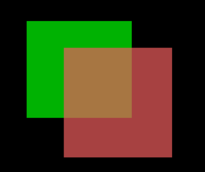
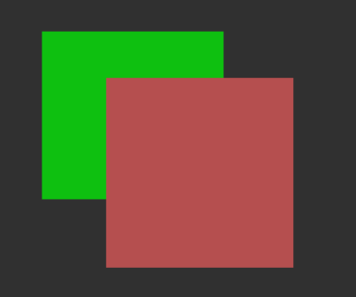

==========================================
annotation remove_segmentation_overlap
==========================================

Description
=================================
塗りつぶしアノテーションの重なりを除去します。
Annofabでインスタンスセグメンテーションは重ねることができてしまいます。
この重なりをなくしたいときに有用です。
オーナーロールまたはチェッカーロールを持つユーザーが実行できます。

Examples
=================================

.. code-block::

    $ annofabcli annotation remove_segmentation_overlap --project_id prj1 --task_id task1

デフォルトでは、休憩中状態のタスクはアノテーションの更新をスキップします。
休憩中状態のタスクも更新する場合は、 ``--include_break_task`` を指定してください。

完了状態のタスクを更新するには、オーナーロールで ``--include_complete_task`` を指定してください。

デフォルトでは、保留中状態のタスクはアノテーションの更新をスキップします。
保留中状態のタスクも更新する場合は、 ``--include_on_hold_task`` を指定してください。チェッカーロールで更新した場合、更新後は未着手状態になります。

オーナーロールでは、タスクの担当者や状態を変更せずにアノテーションを更新できます。
チェッカーロールで自身が担当者ではないタスクを更新するには、 ``--change_operator_to_me`` を指定してください。担当者を一時的に自分自身に変更して更新を実行します。オーナーロールで指定しても効果はありません。

    
    コマンドの実行前の状態。塗りつぶしアノテーションは重なっている。

    
    コマンドの実行後の状態。塗りつぶしアノテーションは重なりが削除されている。

Usage Details
=================================

.. argparse::
    :ref: annofabcli.annotation.remove_segmentation_overlap.add_parser
    :prog: annofabcli annotation remove_segmentation_overlap
    :nosubcommands:
    :nodefaultconst:

See also
=================================
*  `annofabcli annotation restore <../annotation/restore.html>`_
