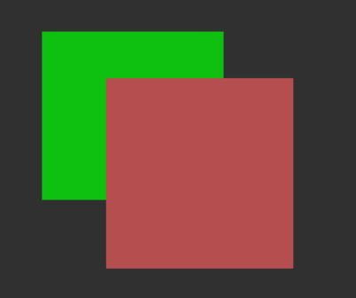

==========================================
annotation remove_segmentation_overlap
==========================================

Description
=================================
塗りつぶしアノテーションの重なりを除去します。
Annofabでインスタンスセグメンテーションは重ねることができてしまいます。
この重なりをなくしたいときに有用です。

Examples
=================================

.. code-block::

    $ annofabcli annotation remove_segmentation_overlap --project_id prj1 --task_id task1

    
    コマンドの実行前の状態。塗りつぶしアノテーションは重なっている。

    
    コマンドの実行後の状態。塗りつぶしアノテーションは重なりが削除されている。

Usage Details
=================================

.. argparse::
    :ref: annofabcli.annotation.remove_segmentation_overlap.add_parser
    :prog: annofabcli annotation remove_segmentation_overlap
    :nosubcommands:
    :nodefaultconst:

See also
=================================
*  `annofabcli annotation restore <../annotation/restore.html>`_
