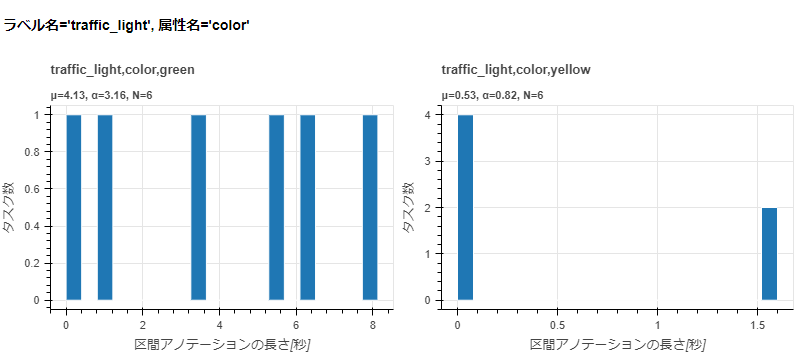

======================================================================
annotation_zip visualize_annotation_duration_by_attribute_value
======================================================================

Description
=================================

動画プロジェクトのタスクごとに区間アノテーションの長さを合計し、ラベル・属性・属性値別のヒストグラムをHTMLファイルに出力します。
既定の集計対象はドロップダウン、ラジオボタン、チェックボックスです。

入力、集計単位、表示単位、ビン幅、0件時の出力については
:doc:`visualize_annotation_duration_by_label` と共通です。

Examples
=================================

.. code-block:: bash

    $ annofabcli annotation_zip visualize_annotation_duration_by_attribute_value \
        --project_id prj1 --output annotation_duration_by_attribute_value.html

出力される ``annotation_duration_by_attribute_value.html`` の例です。
横軸は区間アノテーションの合計長、縦軸はタスク数です。

``--attribute_name`` は指定した属性のみを集計します。
``--additional_attribute_name`` は既定の属性に指定属性を追加します。この2引数は同時に指定できません。
いずれも複数の英語名、または ``file://`` で属性名を記載したファイルを指定できます。
ラベルを絞り込む場合は ``--label_name`` を併用します。

.. code-block:: bash

    $ annofabcli annotation_zip visualize_annotation_duration_by_attribute_value \
        --project_id prj1 --annotation annotation.zip \
        --label_name traffic_light --attribute_name color \
        --use_japanese_name --output annotation_duration_by_attribute_value.html

集計結果をCSV/JSONで出力する場合は :doc:`sum_annotation_duration_by_attribute_value` を使用してください。
日本語名表示については :doc:`index` を参照してください。

Command line options
=================================

.. argparse::
   :ref: annofabcli.annotation_zip.visualize_annotation_duration_by_attribute_value.add_parser
   :prog: annofabcli annotation_zip visualize_annotation_duration_by_attribute_value
   :nosubcommands:
