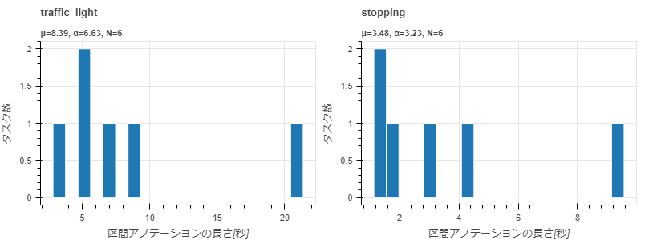

=================================================================
annotation_zip visualize_annotation_duration_by_label
=================================================================

Description
=================================

動画プロジェクトのタスクごとに区間アノテーションの長さを合計し、ラベル別のヒストグラムをHTMLファイルに出力します。
重なる区間もそれぞれ加算します。区間アノテーションがないタスクは0秒として集計します。
集計単位はタスクに固定されています。

``--project_id`` は、 ``--annotation`` を指定する場合も必須です。
アノテーション仕様を参照して対象ラベルと表示順を決めます。
``--annotation`` を省略すると、アノテーションZIPをダウンロードします。

Examples
=================================

.. code-block:: bash

    $ annofabcli annotation_zip visualize_annotation_duration_by_label \
        --project_id prj1 --output annotation_duration_by_label.html

出力される ``annotation_duration_by_label.html`` の例です。
横軸は区間アノテーションの合計長、縦軸はタスク数です。

ローカルのZIPを参照し、特定のラベルのみを日本語名で表示する例です。

.. code-block:: bash

    $ annofabcli annotation_zip visualize_annotation_duration_by_label \
        --project_id prj1 --annotation annotation.zip --label_name traffic_light \
        --use_japanese_name --output annotation_duration_by_label.html

表示単位とビン幅
--------------------------

表示単位は既定で秒です。分で表示する場合は ``--time_unit minute`` を指定します。
``--bin_width`` は表示単位に関係なく、正の有限な秒数で指定します。小数も指定できます。
次の例は表示単位が分で、ビン幅が30秒（0.5分）です。

.. code-block:: bash

    $ annofabcli annotation_zip visualize_annotation_duration_by_label \
        --project_id prj1 --output annotation_duration_by_label.html \
        --time_unit minute --bin_width 30 --arrange_bin_edge

``--arrange_bin_edge`` はすべてのヒストグラムの範囲とビン幅をそろえます。
``--exclude_empty_value`` は全タスクで合計長が0の系列を描画しません。
対象タスクが0件の場合は、見出しとメタデータのみのHTMLファイルを出力します。

集計結果をCSV/JSONで出力する場合は :doc:`sum_annotation_duration_by_label` を使用してください。
日本語名表示については :doc:`index` を参照してください。

Command line options
=================================

.. argparse::
   :ref: annofabcli.annotation_zip.visualize_annotation_duration_by_label.add_parser
   :prog: annofabcli annotation_zip visualize_annotation_duration_by_label
   :nosubcommands:
