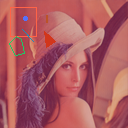

=================================
filesystem draw_annotation
=================================

Description
=================================
アノテーションzip、またはそれを展開したディレクトリに存在するアノテーションを描画します。

Examples
=================================

基本的な使い方
--------------------------

``--annotation`` には、Annofabからダウンロードしたアノテーションzipか、アノテーションzipを展開したディレクトリを指定してください。
アノテーションzipは、`annofabcli annotation download <../annotation/download.html>`_ コマンドでダウンロードできます。

.. code-block::

    # アノテーションzipをダウンロードする。
    $ annofabcli annotation download --project_id prj1 --output annotation.zip

``--image_dir`` には、画像が格納されているディレクトリを指定してください。
``--input_data_id_csv`` には、input_data_idと画像ファイルを紐付けたCSVを指定してください。

CSVのフォーマットは以下の通りです。

* カンマ区切り
* ヘッダ行なし

.. csv-table::
   :header: 列番号,名前,必須,備考

    1列目,input_data_id,Yes,
    2列目,image_path,Yes,``--image_dir`` に指定したディレクトリからのパス

以下はCSVファイルのサンプルです。

.. code-block::
    :caption: input_data_id.csv

    input_data_id1,image1.png
    input_data_id2,image2.png
    input_data_id3,image3.png
    ...

.. code-block::

    image/
    ├── image1.png
    ├── image2.png
    ...

        
.. code-block::

    $ annofabcli filesystem draw_annotation  --annotation annotation.zip \
    --image_dir image/ \
    --input_data_id_csv input_data_id.csv \
    --output_dir out/

ディレクトリ ``out`` には、描画されたアノテーションの画像が出力されます。ディレクトリ構成はアノテーションzipと同じです。ファイル名は ``{入力データID}.{拡張子}`` です。

.. code-block::

    out/
    ├── task1/
    │   ├── input_data_id_1.png
    │   ├── input_data_id_2.png
    ├── task2/
    │   ├── input_data_id_3.png
    │   ├── input_data_id_4.png
    ...

アノテーションのみを描画する
----------------------------------------------------
アノテーションのみを描画する場合は、``--default_image_size`` を指定してください。

.. code-block::

    $ annofabcli filesystem draw_annotation  --annotation annotation.zip \
    --default_image_size 1280x720 \
    --output_dir out/

ポリラインの描画方法
--------------------------
アノテーションzip内のJSONでは、ポリゴンアノテーションとポリラインアノテーションを区別することができません。
デフォルトでは「ポリゴン」とみなして描画するため、ポリラインとして描画するには、「ポリラインのラベル」を指定する必要があります。

.. code-block::

    $ annofabcli filesystem draw_annotation  --annotation annotation.zip \
    --image_dir image/ \
    --input_data_id_csv input_data_id.csv \
    --output_dir out/ \
    --polyline_label fish

.. warning::
    
    このオプションはアノテーションzipの課題を解決するための、暫定的なオプションです。
    アノテーションzipでポリゴンかポリラインかを判断できるようになれば、このオプションは削除する予定です。

描画対象のアノテーションの絞り込み
----------------------------------------------------
描画対象のアノテーションを絞り込む場合は、``--label_name`` に描画対象のラベル名を指定してください。

.. code-block::

    $ annofabcli filesystem draw_annotation  --annotation annotation.zip \
    --image_dir image/ \
    --input_data_id_csv input_data_id.csv \
    --output_dir out/
    --label_name car bike

色の指定
--------------------------

描画するアノテーションの色を指定する場合は、 ``--label_color`` にラベル名と色の対応関係をJSON形式で指定してください。

.. code-block::

    $ annofabcli filesystem draw_annotation  --annotation annotation.zip \
    --image_dir image/ \
    --input_data_id_csv input_data_id.csv \
    --output_dir out/
    --label_color '{"dog":"red", "cat":"blue"}'

「色」は、以下のフォーマットをサポートしています。
フォーマットの詳細は、`Pillow - ImageColor Module <https://pillow.readthedocs.io/en/stable/reference/ImageColor.html>`_ を参照してください。

* HTML color names： ``"red"``
* 16進数： ``"#add8e6"``
* 10進数（文字列）： ``"rgb(0, 0, 255)"``
* 10進数（リスト）： ``[0, 0, 255]``
  
    
アノテーション仕様画面で設定されている色を指定する場合は、`annofabcli annotation_specs list_label_color <../annotation_specs/list_label_color.html>`_ コマンドの出力結果を使用してください。

.. code-block::

    $ annofabcli annotation_specs list_label_color --project_id prj1 --output label_color.json

    $ cat label_color.json
    {
        "cat": [
            255,
            0,
            0
        ],
        "dog": [
            0,
            255,
            0
        ],
        // ...
    }
        
    $ annofabcli filesystem draw_annotation  --annotation annotation.zip \
    --image_dir image/ \
    --input_data_id_csv input_data_id.csv \
    --output_dir out/
    --label_color file://label_color.json

描画オプション
----------------------------------------------------

``--drawing_options`` で、描画オプションをJSON形式で指定できます。利用できるキーは以下の通りです。

* ``line_width`` : 線の太さ[pixel]

.. code-block::

    $ annofabcli filesystem draw_annotation  --annotation annotation.zip \
    --image_dir image/ \
    --input_data_id_csv input_data_id.csv \
    --output_dir out/
    --drawing_options '{"line_width": 3}'

タスクの絞り込み
--------------------------
描画対象のタスクを指定する場合は、``--task_id`` に描画対象タスクのtask_idを指定してください。

.. code-block::

    $ annofabcli filesystem draw_annotation  --annotation annotation.zip \
    --image_dir image/ \
    --input_data_id_csv input_data_id.csv \
    --output_dir out/
    --task_id task1 task2

``--task_query`` を指定して、タスクのフェーズやステータスで絞り込むことができます。

.. code-block::

    $ annofabcli filesystem filter_annotation  --annotation annotation.zip \
    --task_query '{"status":"complete"}' \
    --output_dir out/

``--task_query`` の詳細は、`Command line options <../../user_guide/command_line_options.html#task-query-tq>`_ を参照してください。

Usage Details
=================================

.. argparse::
   :ref: annofabcli.filesystem.draw_annotation.add_parser
   :prog: annofabcli filesystem draw_annotation
   :nosubcommands:
   :nodefaultconst:

See also
=================================

* `アノテーションzipの構造 <https://annofab.com/docs/api/#section/Simple-Annotation-ZIP>`_
* `annofabcli annotation_specs list_label_color <../annotation_specs/list_label_color.html>`_

