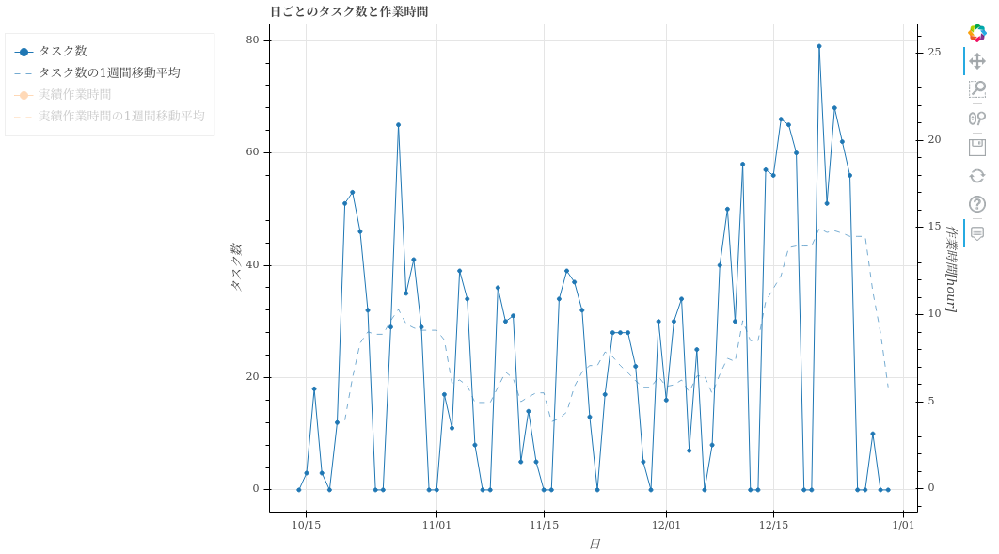

=====================
statistics list_annotation_count
=====================

Description
=================================

生産性に関するCSVファイルやグラフを出力します。

出力結果から主に以下のことが分かります。

* 生産性の日ごとの推移
* ユーザごとの生産性と品質

Examples
=================================

基本的な使い方
--------------------------

出力対象のプロジェクトのproject_idを指定してください。複数のプロジェクトを指定することも可能です。

.. code-block::

    $ annofabcli statistics visualize --project_id prj1 --output_dir out_dir

集計対象のタスクの条件を ``--task_query`` で指定してください。

.. code-block::

    $ annofabcli statistics visualize --project_id prj1 --output_dir out_dir
    --task_query '{"status": "complete"}' 

.. note::

    できるだけ正しい生産性を求める場合は、``--task_query '{"status": "complete"}'`` を指定して、完了状態のタスクのみを集計対象としてください。
    デフォルトでは完了状態でないタスクも「生産した」とみなすからです。

集計期間も指定できます。``--start_date`` は、指定した日付以降に教師付を開始したタスクを集計します。``--end_date`` 以前に更新されたタスクを集計します。

.. code-block::

    $ annofabcli statistics visualize --project_id prj1 --output_dir out_dir \
    --start_date 2020-04-01

複数のプロジェクトをマージする
----------------------------------------------
``--project_id`` に複数のproject_idを指定したときに ``--merge`` を指定すると、指定したプロジェクトをマージしたディレクトリも出力します。ディレクトリ名は ``merge`` です。

並列処理
----------------------------------------------

``--project_id`` に複数のproject_idを指定したときは、並列実行が可能です。

.. code-block::

    $ annofabcli input_data put --project_id file://project_id.txt --output out_dir/
    --parallelism 4

出力結果
=================================

``--project_id`` に1個のproject_idを指定した場合
--------------------------------------------------------------------------------------------

.. code-block::

    $ annofabcli statistics visualize --project_id prj1 --output_dir out_dir --minimal

`out_dir <https://github.com/kurusugawa-computer/annofab-cli/blob/master/docs/command_reference/statistics/list_annotation_count/out_dir>`_

.. code-block::

    out_dir/
    ├── line-graph
    │   ├── 折れ線-横軸_日-全体.html
    │   ├── 累積折れ線-横軸_アノテーション数-教師付者用.html
    │   ├── 累積折れ線-横軸_アノテーション数-受入者用.html
    │   └── 累積折れ線-横軸_日-全体.html
    ├── scatter
    │   ├── 散布図-アノテーションあたり作業時間と品質の関係-実績時間-教師付者用.html
    │   ├── 散布図-アノテーションあたり作業時間と累計作業時間の関係-計測時間.html
    │   ├── 散布図-アノテーションあたり作業時間と累計作業時間の関係-実績時間.html
    ├── タスクlist.csv
    ├── メンバごとの生産性と品質.csv
    └── 日毎の生産量と生産性.csv

タスクlist.csv
^^^^^^^^^^^^^^^^^^^^^^^^^^^^^^^^^^^^^^^^^^^^^^^^^^^
タスクごとの情報が記載されています。主に以下の情報が分かります。

* 教師付/検査/受入の作業時間
* 最初に教師付/検査/受入したユーザ

`タスクlist.csv <https://github.com/kurusugawa-computer/annofab-cli/blob/master/docs/command_reference/statistics/list_annotation_count/out_dir/タスクlist.csv>`_

日毎の生産量と生産性.csv
^^^^^^^^^^^^^^^^^^^^^^^^^^^^^^^^^^^^^^^^^^^^^^^^^^^
全体の生産量（作業したタスク数など）や生産性が、日毎に記載されています。

`日毎の生産量と生産性.csv <https://github.com/kurusugawa-computer/annofab-cli/blob/master/docs/command_reference/statistics/list_annotation_count/out_dir/日毎の生産量と生産性.csv>`_

* monitored_worktime_hour: 計測作業時間[hour](アノテーションエディタ画面を触っていた作業時間）
* actual_worktime_hour: 実績作業時間[hour](労務管理画面から入力した作業時間）
* task_count: 作業したタスク数。タスクが完了状態になったときに「作業した」とみなしている。
* input_data_count: 作業したタスクに含まれている入力データ数
* actual_worktime/annotation_count: アノテーションあたりの実績作業時間[hour]。生産性の指標になる。
* actual_worktime_hour/annotation_count__lastweek: actual_worktime/annotation_count の1週間移動平均

.. warning::

    task_count は「タスクが完了状態になった日」から集計しています。「タスクが受入取り消しされない」という前提で集計しています。
    したがって、大量のタスクが受入取り消しされると ``task_count`` が信頼できなくなることに注意してください。
    
    
    たとえばtask1が、2020/01/01に受入完了して、2020/01/02に受入取り消し、2020/01/03に再度受入完了状態になっとします。その場合、task1は2020/01/03に「作業した」ものとして集計されます。

    
メンバごとの生産性と品質.csv
^^^^^^^^^^^^^^^^^^^^^^^^^^^^^^^^^^^^^^^^^^^^^^^^^^^
メンバごとの生産量（作業したタスク数など）や生産性、教師付の品質が分かります。

`メンバごとの生産性と品質.csv <https://github.com/kurusugawa-computer/annofab-cli/blob/master/docs/command_reference/statistics/list_annotation_count/out_dir/メンバごとの生産性と品質.csv>`_

参照頻度が高い列の内容を、以下に記載します。

* monitored_worktime_hour: 計測作業時間[hour](アノテーションエディタ画面を触っていた作業時間）
* actual_worktime_hour: 実績作業時間[hour](労務管理画面から入力した作業時間）
* task_count: 作業したタスク数
* input_data_count: 作業したタスクに含まれている入力データ数
* actual_worktime/annotation_count: アノテーションあたりの実績作業時間[hour]。生産性の指標になる。
* pointed_out_inspection_comment_count/annotation_count: アノテーションあたりの指摘を受けた個数[hour]。品質の指標になる。
* rejected_count/task_count: タスクあたりの差し戻された回数。品質の指標になる。

.. note::

    タスクの教師付を複数人で作業した場合、ユーザごとにmonitored_worktime_hourで按分した値を「作業した」とみなします。
    たとえば、task1の教師付の作業にユーザAが45分、ユーザBが15分かかっとします。その場合、「ユーザAはtask1を0.75、ユーザBはtask1を0.25作業した」とみなします。
    したがって、task_countは小数になる場合があります。

.. note::

    品質の指標は以下の2つです。

    * pointed_out_inspection_comment_count/annotation_count
    * rejected_count/task_count

    ``rejected_count/task_count`` より ``pointed_out_inspection_comment_count/annotation_count`` の方が粒度が細かいので、 通常のプロジェクトでは  ``pointed_out_inspection_comment_count/annotation_count`` の方が良い指標になります。
    

折れ線-横軸_日-全体.html
^^^^^^^^^^^^^^^^^^^^^^^^^^^^^^^^^^^^^^^^^^^^^^^^^^^
タスク数や作業時間、生産性などを、日毎にプロットした折れ線グラフです。日毎のタスク数や作業時間、生産性などをの推移が分かります。

`折れ線-横軸_日-全体.html <https://raw.githubusercontent.com/kurusugawa-computer/annofab-cli/master/docs/command_reference/statistics/list_annotation_count/out_dir/メンバごとの生産性と品質.csv>`_

.. image:: visualize/img/日ごとのアノテーションあたり作業時間.png

複数指定
----------------------------------------------

.. code-block::

    $ annofabcli statistics list_annotation_count --project_id prj1 --output_dir out_by_input_data/ \
    --group_by input_data_id

`out_by_input_data <https://github.com/kurusugawa-computer/annofab-cli/blob/master/docs/command_reference/statistics/list_annotation_count/out_by_input_data>`_

`メンバごとの生産性と品質.csv <https://github.com/kurusugawa-computer/annofab-cli/blob/master/docs/command_reference/statistics/list_annotation_count/out_dir/メンバごとの生産性と品質.csv>`_

マージ済
----------------------------------------------
