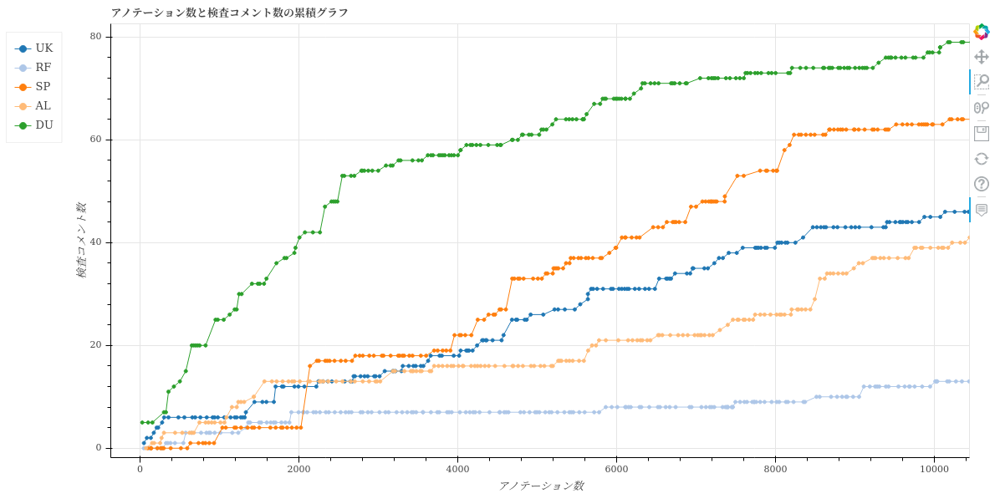
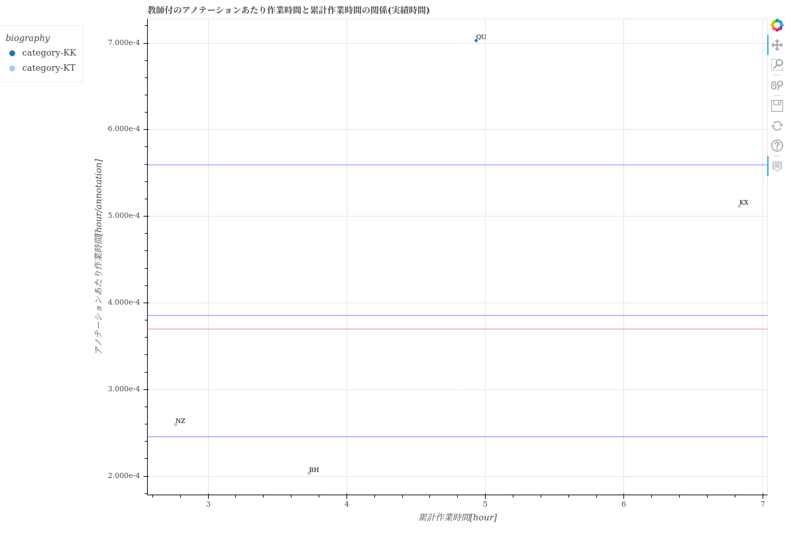

=====================
statistics visualize
=====================

Description
=================================

生産量や生産性に関するCSVファイルやグラフを出力します。

出力結果から主に以下のことが分かります。

* 生産量や生産性の日ごとの推移
* ユーザごとの生産性と品質

Examples
=================================

基本的な使い方
--------------------------

出力対象のプロジェクトのproject_idを指定してください。複数のプロジェクトを指定することも可能です。

.. code-block::

    $ annofabcli statistics visualize --project_id prj1 --output_dir out_dir

集計対象のタスクの条件を ``--task_query`` で指定してください。

.. code-block::

    $ annofabcli statistics visualize --project_id prj1 --output_dir out_dir
    --task_query '{"status": "complete"}' 

.. note::

    できるだけ正しい生産性を求める場合は、``--task_query '{"status": "complete"}'`` を指定して、完了状態のタスクのみを集計対象としてください。
    デフォルトでは完了状態でないタスクも「生産した」とみなします。

集計期間も指定できます。``--start_date`` は、指定した日付以降に教師付を開始したタスクを集計します。``--end_date`` は、指定した日付以前に更新されたタスクを集計します。

.. code-block::

    $ annofabcli statistics visualize --project_id prj1 --output_dir out_dir \
    --start_date 2020-04-01

デフォルトでは10個以上のファイルを出力します。よく利用するファイルのみ出力する場合は、 ``--minimal`` を指定してください。

.. code-block::

    $ annofabcli input_data put --project_id prj1 --output out_dir/
    --minimal

実績作業時間情報から生産性を算出する
----------------------------------------------
デフォルトではアノテーションエディタ画面を触っていた作業時間（以下、「計測作業時間」と呼ぶ）を元に、生産性を算出します。
計測作業時間はコミュニケーションしている時間やアノテーションルールを読んでいる時間を含みません。
したがって、計測作業時間から算出した生産性を元にアノテーションの生産量を見積もると、見積もりから大きく外れる恐れがあります。

アノテーションの生産量を見積もる場合は、アノテーションエディタ以外の作業も含めた作業時間（以下、「実績作業時間」と呼ぶ）で生産性を算出することを推奨します。
実績作業時間から算出した生産性を出力するには、実績作業時間が記載されたCSVを ``--labor_csv`` に渡してください。

.. code-block::

    $ annofabcli input_data put --project_id prj1 --labor_csv labor.csv \
    --output out_dir/

以下、実績作業時間が記載されたCSV( ``labor.csv`` )のサンプルです。

.. csv-table::
   :header: date,account_id,actual_worktime_hour,project_id

    2021-04-01,12345678-abcd-1234-abcd-1234abcd5678,8,prj1
    2021-04-02,12345678-abcd-1234-abcd-1234abcd5678,6.5,prj1

.. warning::

    2021-10-01 時点で、AnnoFabに実績作業時間を格納することができます。AnnoFabに可能されている実績作業時間を参照する場合は、``--get_labor`` を指定してください。
    ただし、``--get_labor`` は将来的に廃止します。AnnoFabには実績作業時間は、いずれ参照できなくなるためです。
    替わりに ``--labor_csv`` を利用してください。
    

複数のプロジェクトをマージする
----------------------------------------------
``--project_id`` に複数のproject_idを指定したときに ``--merge`` を指定すると、指定したプロジェクトをマージしたディレクトリも出力します。ディレクトリ名は ``merge`` です。

.. code-block::

    $ annofabcli input_data put --project_id prj1 prj2 --output out_dir/
    --merge

並列処理
----------------------------------------------

``--project_id`` に複数のproject_idを指定したときは、並列実行が可能です。

.. code-block::

    $ annofabcli input_data put --project_id file://project_id.txt --output out_dir/
    --parallelism 4

出力結果
=================================

1個のプロジェクトを指定した場合
--------------------------------------------------------------------------------------------

.. code-block::

    $ annofabcli statistics visualize --project_id prj1 --output_dir out_dir --minimal

`out_dir <https://github.com/kurusugawa-computer/annofab-cli/blob/master/docs/command_reference/statistics/visualize/out_dir>`_

.. code-block::

    out_dir/
    ├── line-graph
    │   ├── 折れ線-横軸_日-全体.html
    │   ├── 累積折れ線-横軸_アノテーション数-教師付者用.html
    │   ├── 累積折れ線-横軸_アノテーション数-受入者用.html
    │   └── 累積折れ線-横軸_日-全体.html
    ├── scatter
    │   ├── 散布図-教師付者の品質と作業量の関係.html
    │   ├── 散布図-アノテーションあたり作業時間と累計作業時間の関係-計測時間.html
    │   ├── 散布図-アノテーションあたり作業時間と累計作業時間の関係-実績時間.html
    ├── タスクlist.csv
    ├── メンバごとの生産性と品質.csv
    ├── 日毎の生産量と生産性.csv
    └── 全体の生産性と品質.csv

タスクlist.csv
^^^^^^^^^^^^^^^^^^^^^^^^^^^^^^^^^^^^^^^^^^^^^^^^^^^
タスクごとの情報が記載されています。主に以下の情報が分かります。

* 教師付/検査/受入の作業時間
* 最初に教師付/検査/受入したユーザ

`タスクlist.csv <https://github.com/kurusugawa-computer/annofab-cli/blob/master/docs/command_reference/statistics/visualize/out_dir/タスクlist.csv>`_

日毎の生産量と生産性.csv
^^^^^^^^^^^^^^^^^^^^^^^^^^^^^^^^^^^^^^^^^^^^^^^^^^^
全体の生産量（作業したタスク数など）や生産性が、日毎に記載されています。

`日毎の生産量と生産性.csv <https://github.com/kurusugawa-computer/annofab-cli/blob/master/docs/command_reference/statistics/visualize/out_dir/日毎の生産量と生産性.csv>`_

参照頻度が高い列の詳細を、以下に記載します。

* monitored_worktime_hour: 計測作業時間[hour](アノテーションエディタ画面を触っていた作業時間）
* actual_worktime_hour: 実績作業時間[hour](労務管理画面から入力した作業時間）
* task_count: 作業したタスク数。タスクが完了状態になったときに「作業した」とみなしている。
* input_data_count: 作業したタスクに含まれている入力データ数
* actual_worktime/annotation_count: アノテーションあたりの実績作業時間[hour]。生産性の指標になる。
* actual_worktime_hour/annotation_count__lastweek: actual_worktime/annotation_count の1週間移動平均

.. warning::

    task_count は「タスクが完了状態になった日」から集計しています。「タスクが受入取り消しされない」という前提で集計しています。
    したがって、大量のタスクが受入取り消しされると ``task_count`` が信頼できなくなることに注意してください。
    
    
    たとえばtask1が、2020/01/01に受入完了して、2020/01/02に受入取り消し、2020/01/03に再度受入完了状態になっとします。その場合、task1は2020/01/03に「作業した」ものとして集計されます。

メンバごとの生産性と品質.csv
^^^^^^^^^^^^^^^^^^^^^^^^^^^^^^^^^^^^^^^^^^^^^^^^^^^
メンバごとの生産量（作業したタスク数など）や生産性、教師付の品質が分かります。

`メンバごとの生産性と品質.csv <https://github.com/kurusugawa-computer/annofab-cli/blob/master/docs/command_reference/statistics/visualize/out_dir/メンバごとの生産性と品質.csv>`_

参照頻度が高い列の詳細を、以下に記載します。

* monitored_worktime_hour: 計測作業時間[hour](アノテーションエディタ画面を触っていた作業時間）
* actual_worktime_hour: 実績作業時間[hour](労務管理画面から入力した作業時間）
* task_count: 作業したタスク数
* input_data_count: 作業したタスクに含まれている入力データ数
* actual_worktime/annotation_count: アノテーションあたりの実績作業時間[hour]。生産性の指標になる。
* pointed_out_inspection_comment_count/annotation_count: アノテーションあたりの指摘を受けた個数（対応完了状態の検査コメント）。品質の指標になる。
* rejected_count/task_count: タスクあたりの差し戻された回数。品質の指標になる。

.. note::

    タスクの教師付を複数人で作業した場合、ユーザごとにmonitored_worktime_hourで按分した値を「作業した」とみなします。
    たとえば、task1の教師付の作業にユーザAが45分、ユーザBが15かかっとします。その場合、「ユーザAはtask1を0.75、ユーザBはtask1を0.25作業した」とみなします。
    したがって、task_countは小数になる場合があります。

.. note::

    品質の指標は以下の2つです。

    * pointed_out_inspection_comment_count/annotation_count
    * rejected_count/task_count

    ``rejected_count/task_count`` より ``pointed_out_inspection_comment_count/annotation_count`` の方が粒度が細かいので、 通常のプロジェクトでは  ``pointed_out_inspection_comment_count/annotation_count`` の方が良い指標になります。
    

全体の生産性と品質.csv
^^^^^^^^^^^^^^^^^^^^^^^^^^^^^^^^^^^^^^^^^^^^^^^^^^^
全体の生産性と品質が記載されています。
``メンバごとの生産性と品質.csv`` の内容を集計した値になります。

`全体の生産性と品質.csv <https://github.com/kurusugawa-computer/annofab-cli/blob/master/docs/command_reference/statistics/visualize/out_dir/全体の生産性と品質.csv>`_

折れ線-横軸_日-全体.html
^^^^^^^^^^^^^^^^^^^^^^^^^^^^^^^^^^^^^^^^^^^^^^^^^^^
タスク数や作業時間、生産性などを、日毎にプロットした折れ線グラフです。
グラフのデータは ``日毎の生産量と生産性.csv`` を参照しています。

日毎のタスク数や作業時間、生産性などをの推移が分かります。

`折れ線-横軸_日-全体.html <https://kurusugawa-computer.github.io/annofab-cli/command_reference/statistics/visualize/out_dir/line-graph/%E6%8A%98%E3%82%8C%E7%B7%9A-%E6%A8%AA%E8%BB%B8_%E6%97%A5-%E5%85%A8%E4%BD%93.html>`_

.. image:: visualize/img/日ごとのタスク数と作業時間.png

.. image:: visualize/img/日ごとのアノテーションあたり作業時間.png

累積折れ線-横軸_日-全体.html
^^^^^^^^^^^^^^^^^^^^^^^^^^^^^^^^^^^^^^^^^^^^^^^^^^^
タスク数や作業時間の累積値をプロットした折れ線グラフです。
グラフのデータは ``日毎の生産量と生産性.csv`` を参照しています。

`累積折れ線-横軸_日-全体.html <https://kurusugawa-computer.github.io/annofab-cli/command_reference/statistics/visualize/out_dir/line-graph/%E7%B4%AF%E7%A9%8D%E6%8A%98%E3%82%8C%E7%B7%9A-%E6%A8%AA%E8%BB%B8_%E6%97%A5-%E5%85%A8%E4%BD%93.html>`_

累積折れ線-横軸_アノテーション数-{phase}者用.html
^^^^^^^^^^^^^^^^^^^^^^^^^^^^^^^^^^^^^^^^^^^^^^^^^^^
作業したタスクに含まれているアノテーション数の累積値と、作業時間などの累積値をタスクごとにプロットした折れ線グラフです。
グラフのデータは ``タスクlist.csv`` を参照しています。

生産性や品質について、習熟傾向やユーザごとの優劣が分かります。

`累積折れ線-横軸_アノテーション数-教師付者用.html <https://kurusugawa-computer.github.io/annofab-cli/command_reference/statistics/visualize/out_dir/line-graph/%E7%B4%AF%E7%A9%8D%E6%8A%98%E3%82%8C%E7%B7%9A-%E6%A8%AA%E8%BB%B8_%E3%82%A2%E3%83%8E%E3%83%86%E3%83%BC%E3%82%B7%E3%83%A7%E3%83%B3%E6%95%B0-%E6%95%99%E5%B8%AB%E4%BB%98%E8%80%85%E7%94%A8.html>`_

以下のグラフは、作業したタスクに含まれているアノテーション数の累積値と、教師付作業時間の累積値をプロットした折れ線グラフで、生産性を評価できます。
生産性が高いほど、グラフの傾きは小さくなります。

.. image:: visualize/img/アノテーション数と教師付作業時間の累積グラフ.png

.. note::

    あるタスクを作業したユーザは「最初に作業したユーザ」とみなして、プロットしています。
    たとえば、task1の教師付の作業にユーザAが45分、ユーザBが15分かかったとします。その場合、「ユーザAはtask1を60分作業した、ユーザBはtask1を作業していない」とみなします。
    したがって、1個のタスクを複数人で均等に作業する場合は、生産性を正しく表現できない恐れがあります。

以下のグラフは、作業したタスクに含まれているアノテーション数の累積値と、検査コメント数の累積値をプロットした折れ線グラフで、教師付の品質を評価できます。
検査コメント数とは指摘を受けたコメントの数です。

教師付の品質が高いほど、グラフの傾きは小さくなる傾向にあります。

.. note::

    1個のタスクに同じ内容の指摘を複数回受けた場合、本来の品質より悪く評価される場合があります。
    また軽微な指摘も重大な指摘も「同じレベルの指摘」として扱っているため、正しく品質を評価するには、指摘の中身まで確認した方が良い場合もあります。

受入作業した場合は、`累積折れ線-横軸_アノテーション数-受入者用.html <https://kurusugawa-computer.github.io/annofab-cli/command_reference/statistics/visualize/out_dir/line-graph/%E7%B4%AF%E7%A9%8D%E6%8A%98%E3%82%8C%E7%B7%9A-%E6%A8%AA%E8%BB%B8_%E3%82%A2%E3%83%8E%E3%83%86%E3%83%BC%E3%82%B7%E3%83%A7%E3%83%B3%E6%95%B0-%E5%8F%97%E5%85%A5%E8%80%85%E7%94%A8.html>`_ も出力します。

.. warning::

    一般的に検査/受入作業は、複数人で作業します。したがって、検査/受入の生産性は正しく表現できていない恐れがあります。
    
    
散布図-アノテーションあたり作業時間と累計作業時間の関係-xxxx.html
^^^^^^^^^^^^^^^^^^^^^^^^^^^^^^^^^^^^^^^^^^^^^^^^^^^^^^^^^^^^^^^^^^^^^^^^^^^^^^^^^^^^^^^^^^^^^^^^^^^^^^
生産性の指標である「アノテーションあたり作業時間」と累計作業時間の関係を、ユーザごとにプロットした散布図です。
グラフのデータは ``メンバごとの生産性と品質.csv`` を参照しています。

グラフから、ユーザごとの生産性や経験値（累計作業時間）が分かります。

`散布図-アノテーションあたり作業時間と累計作業時間の関係-実績時間.html <https://kurusugawa-computer.github.io/annofab-cli/command_reference/statistics/visualize/out_dir/scatter/%E6%95%A3%E5%B8%83%E5%9B%B3-%E3%82%A2%E3%83%8E%E3%83%86%E3%83%BC%E3%82%B7%E3%83%A7%E3%83%B3%E3%81%82%E3%81%9F%E3%82%8A%E4%BD%9C%E6%A5%AD%E6%99%82%E9%96%93%E3%81%A8%E7%B4%AF%E8%A8%88%E4%BD%9C%E6%A5%AD%E6%99%82%E9%96%93%E3%81%AE%E9%96%A2%E4%BF%82-%E5%AE%9F%E7%B8%BE%E6%99%82%E9%96%93.html>`_

.. note::

    累計作業時間が小さいユーザは、まだ経験値が少ないため、生産性の信頼性が低いです。
    ユーザの生産性を比較する場合は、「累計作業時間が一定値を超えているユーザ」で評価することを推奨します。

散布図-教師付者の品質と作業量の関係.html
^^^^^^^^^^^^^^^^^^^^^^^^^^^^^^^^^^^^^^^^^^^^^^^^^^^^^^^^^^^^^^^^^^^^^^^^^^^^^^^^^^^^^^^^^^^^^^^^^^^^^^
品質と累計作業時間の関係を、ユーザごとにプロットした散布図です。
グラフのデータは ``メンバごとの生産性と品質.csv`` を参照しています。

`散布図-教師付者の品質と作業量の関係.html <https://kurusugawa-computer.github.io/annofab-cli/command_reference/statistics/visualize/out_dir/scatter/%E6%95%A3%E5%B8%83%E5%9B%B3-%E6%95%99%E5%B8%AB%E4%BB%98%E8%80%85%E3%81%AE%E5%93%81%E8%B3%AA%E3%81%A8%E4%BD%9C%E6%A5%AD%E9%87%8F%E3%81%AE%E9%96%A2%E4%BF%82.html>`_

.. image:: visualize/img/散布図-品質-検査コメント数.png

    

複数のプロジェクトを指定した場合
--------------------------------------------------------------------------------------------

.. code-block::

    $ annofabcli statistics visualize --project_id prj1 prj2 --output_dir out_dir --minimal

プロジェクトごとにディレクトリが生成されます。

.. code-block::

    out_dir/
    ├── prj_title1
    │   ├── タスクlist.csv
    │   ├── メンバごとの生産性と品質.csv
    │   └── ...
    ├── prj_title2
    │   ├── タスクlist.csv
    │   ├── メンバごとの生産性と品質.csv
    │   └── ...

``--merge`` を指定した場合
--------------------------------------------------------------------------------------------

.. code-block::

    $ annofabcli statistics visualize --project_id prj1 prj2 --output_dir out_dir --minimal \
    --merge

prj1とprj2の出力結果をマージしたファイルが、``merge`` ディレクトリに出力されます。

.. code-block::

    out_dir/
    ├── prj_title1
    │   ├── タスクlist.csv
    │   ├── メンバごとの生産性と品質.csv
    │   └── ...
    ├── prj_title2
    │   ├── タスクlist.csv
    │   ├── メンバごとの生産性と品質.csv
    │   └── ...
    ├── merge
    │   ├── タスクlist.csv
    │   ├── メンバごとの生産性と品質.csv
    │   └── ...

Usage Details
=================================

.. argparse::
   :ref: annofabcli.statistics.visualize_statistics.add_parser
   :prog: annofabcli statistics visualize
   :nosubcommands:
   :nodefaultconst:
