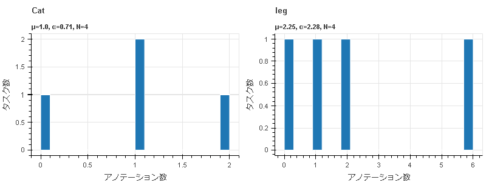

==========================================
statistics visualize_annotation_count
==========================================

Description
=================================

各ラベル、各属性値のアノテーション数をヒストグラムで可視化したファイルを出力します。

Examples
=================================

.. code-block::

    $ annofabcli statistics visualize_annotation_count --project_id prj1 --output_dir out_dir/

.. code-block::

    out_dir/ 
    ├── labels_count.html                ラベルごとのアノテーション数をヒストグラムで可視化したHTMLファイル
    ├── attributes_count.html            属性ごとのアノテーション数をヒストグラムで可視化したHTMLファイル
    │

下図は `labels_count.html <https://kurusugawa-computer.github.io/annofab-cli/command_reference/statistics/visualize_annotation_count/output/labels_count.html>`_ の中身です。ラベル名ごとにヒストグラムが描画されています。

下図は `attributes_count.html <https://kurusugawa-computer.github.io/annofab-cli/command_reference/statistics/visualize_annotation_count/output/attributes_count.html>`_ の中身です。ラベル名、属性名、属性値のペアごとにヒストグラムが描画されています。

.. image:: visualize_annotation_count/img/attributes_count.png
    :alt: attributes_count.htmlの中身

集計対象の属性の種類は以下の通りです。

* ドロップダウン
* ラジオボタン
* チェックボックス

デフォルトではタスクごとにアノテーション数を集計します。入力データごとに集計する場合は、 ``--group_by input_data_id`` を指定してください。

.. code-block::

    $ annofabcli statistics list_annotation_count --project_id prj1 --output_dir out_dir/ \
    --group_by input_data_id

Usage Details
=================================

.. argparse::
   :ref: annofabcli.statistics.visualize_annotation_count.add_parser
   :prog: annofabcli statistics visualize_annotation_count
   :nosubcommands:
   :nodefaultconst:
