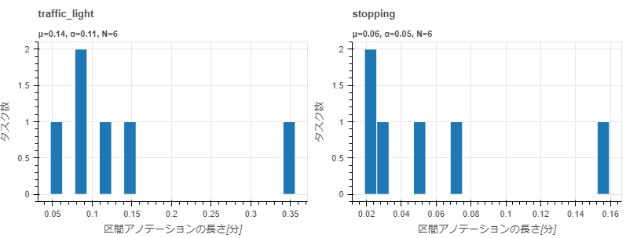
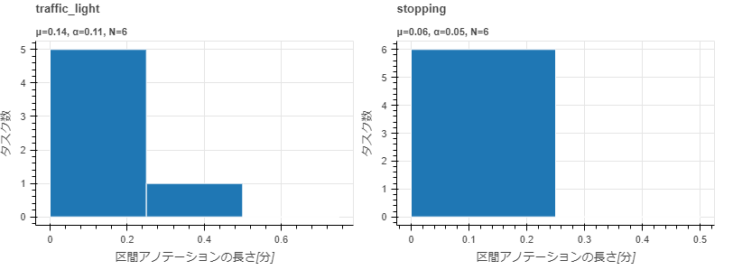

==========================================
statistics visualize_annotation_duration
==========================================

Description
=================================

ラベルごとまたは属性値ごとに、区間アノテーションの長さをヒストグラムで可視化したファイルを出力します。

Examples
=================================

.. code-block::

    $ annofabcli statistics visualize_annotation_duration --project_id prj1 --output_dir out_dir/

.. code-block::

    out_dir/ 
    ├── annotation_duration_by_label.html                ラベルごとの区間アノテーションの長さをヒストグラムで可視化したHTMLファイル
    ├── annotation_duration_by_attribute.html            属性ごとの区間アノテーションの長さをヒストグラムで可視化したHTMLファイル
    │

下図は `annotation_duration_by_label.html <https://kurusugawa-computer.github.io/annofab-cli/command_reference/statistics/visualize_annotation_duration/output/annotation_duration_by_label.html>`_ の中身です。ラベル名ごとにヒストグラムが描画されています。

下図は `annotation_duration_by_attribute.html <https://kurusugawa-computer.github.io/annofab-cli/command_reference/statistics/visualize_annotation_duration/output/annotation_duration_by_attribute.html>`_ の中身です。ラベル名、属性名、属性値のペアごとにヒストグラムが描画されています。

集計対象の属性の種類は以下の通りです。

* ドロップダウン
* ラジオボタン
* チェックボックス

デフォルトでは、動画の長さは「秒」単位で表示されます。「分」単位で表示する場合は、 ``--time_unit minute`` を指定してください。

.. code-block::

    $ annofabcli statistics visualize_annotation_duration --project_id prj1 --output_dir out_dir2/ \
    --time_unit minute

``--bin_width`` を指定するとビンの幅を「秒」単位で指定できます。以下のコマンドはビンの幅を15秒（0.25分）に指定しています。

.. code-block::

    $ annofabcli statistics visualize_annotation_duration --project_id prj1 --output_dir out_dir3/ \
    --time_unit minute --bin_width 15

デフォルトでは、各ヒストグラムのデータの範囲やビンの幅は異なります。すべてのヒストグラムでデータの範囲とビンの幅を揃える場合は、 ``--arrange_bin_edge`` を指定します。

.. code-block::

    $ annofabcli statistics visualize_annotation_duration --project_id prj1 --output_dir out_dir4/ \
    --arrange_bin_edge

    

Usage Details
=================================

.. argparse::
   :ref: annofabcli.statistics.visualize_annotation_duration.add_parser
   :prog: annofabcli statistics visualize_annotation_duration
   :nosubcommands:
   :nodefaultconst:
