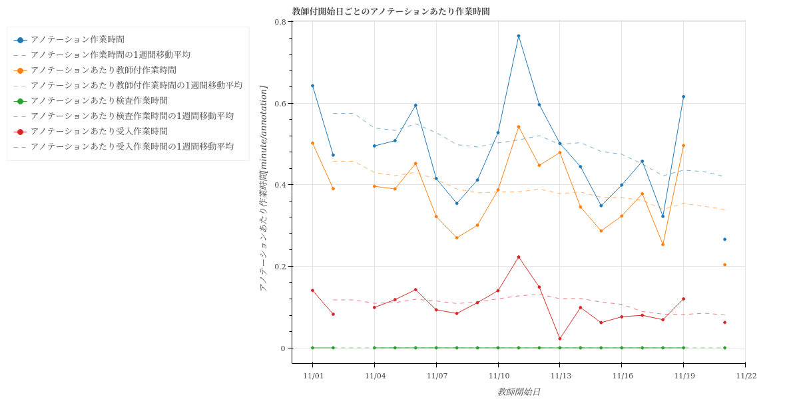

====================================================================================
line-graph/折れ線-横軸_教師付開始日-全体.html
====================================================================================

教師付フェーズを開始した日ごとに作業時間、生産量、生産性をプロットした折れ線グラフです。
グラフのデータは :doc:`教師付開始日毎の生産量と生産性_csv` を参照しています。

`折れ線-横軸_教師付開始日-全体.htmlのサンプル <https://kurusugawa-computer.github.io/annofab-cli/command_reference/statistics/visualize/out_dir/line-graph/折れ線-横軸_教師付開始日-全体.html>`_

