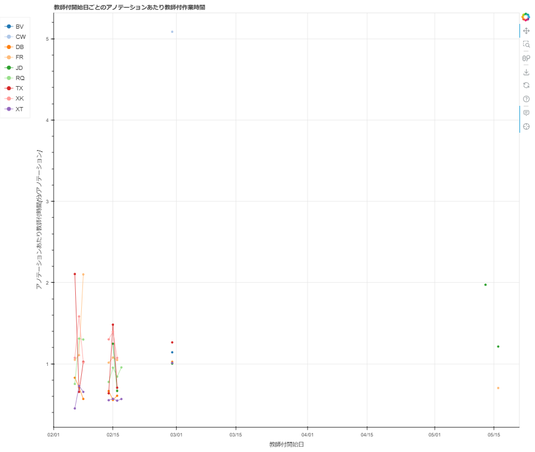

========================================================================================================================================================================
line-graph/{phase}/折れ線-横軸_教師付開始日-縦軸_アノテーション単位の指標-{phase}用.html
========================================================================================================================================================================

横軸がフェーズの開始日、縦軸がアノテーション単位の指標（作業時間、指摘数など）の折れ線グラフです。ユーザーごとにプロットされます。

フェーズごとにhtmlファイルは出力されます。

グラフのデータは :doc:`task-worktime-list-by-user-phase_csv` を参照しています。

`累積折れ線-横軸_アノテーション数-教師付者用.htmlのサンプル <https://kurusugawa-computer.github.io/annofab-cli/command_reference/statistics/visualize/out_dir/line-graph/折れ線-横軸_教師付開始日-縦軸_アノテーション単位の指標-教師付者用.html>`_

.. note::

    複数人で同じあタスクの同じフェーズを作業した場合、ユーザーごとの作業時間で按分した値を生産量や指摘数として算出します。
    たとえば、task1の教師付フェーズの作業にユーザーAが45分、ユーザーBが15分かかったとします。その場合、「ユーザーAはtask1を0.75個、ユーザーBはtask1を0.25個のタスクを作業した」とみなします。
    

