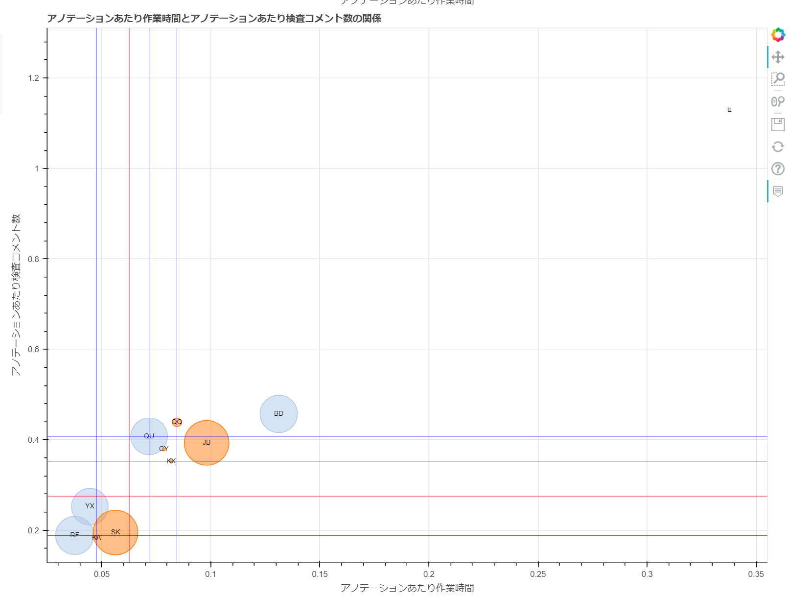

==============================================================================================================================
scatter/散布図-アノテーションあたり作業時間と品質の関係-{worktime_type}-教師付者用.html
==============================================================================================================================

生産性の指標である「アノテーションあたり作業時間」と、品質の指標をプロットした散布図です。
円の大きさは累計作業時間の大きさを表しています。

グラフのデータは :doc:`メンバごとの生産性と品質_csv` を参照しています。

`散布図-アノテーションあたり作業時間と品質の関係-実績時間-教師付者用.htmlのサンプル <https://kurusugawa-computer.github.io/annofab-cli/command_reference/statistics/visualize/out_dir/scatter/散布図-アノテーションあたり作業時間と品質の関係-実績時間-教師付者用.html>`_

