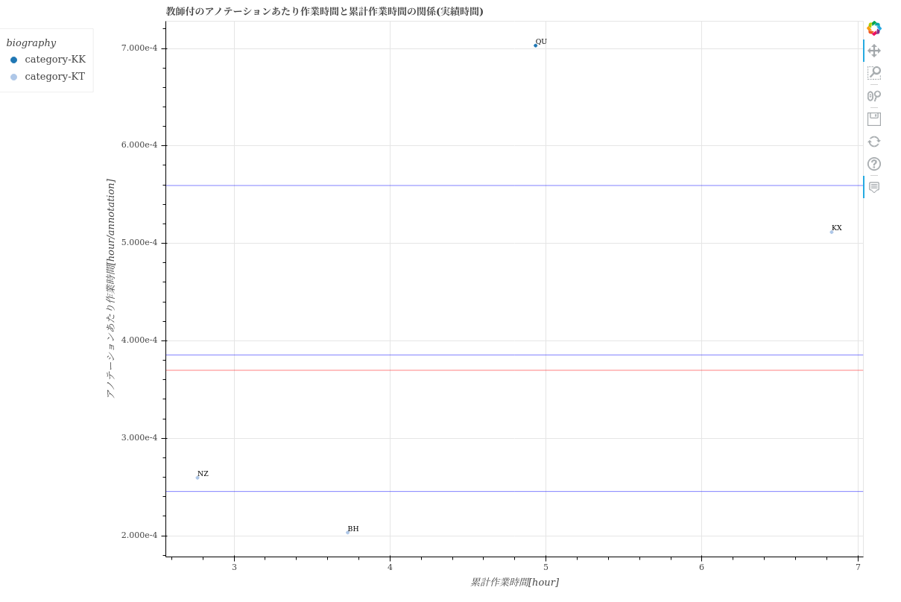

==============================================================================================================================
scatter/散布図-アノテーションあたり作業時間と累計作業時間の関係-{worktime_type}.html
==============================================================================================================================

生産性の指標である「アノテーションあたり作業時間」と累計作業時間の関係を、ユーザごとにプロットした散布図です。
グラフのデータは :doc:`メンバごとの生産性と品質_csv` を参照しています。

グラフから、ユーザごとの生産性や経験値（累計作業時間）が分かります。

`散布図-アノテーションあたり作業時間と累計作業時間の関係-実績時間.htmlのサンプル <https://kurusugawa-computer.github.io/annofab-cli/command_reference/statistics/visualize/out_dir/scatter/%E6%95%A3%E5%B8%83%E5%9B%B3-%E3%82%A2%E3%83%8E%E3%83%86%E3%83%BC%E3%82%B7%E3%83%A7%E3%83%B3%E3%81%82%E3%81%9F%E3%82%8A%E4%BD%9C%E6%A5%AD%E6%99%82%E9%96%93%E3%81%A8%E7%B4%AF%E8%A8%88%E4%BD%9C%E6%A5%AD%E6%99%82%E9%96%93%E3%81%AE%E9%96%A2%E4%BF%82-%E5%AE%9F%E7%B8%BE%E6%99%82%E9%96%93.html>`_

.. note::

    累計作業時間が小さいユーザーは、作業に慣れていないため生産性の信頼性が低いです。
    ユーザーの生産性を比較する場合は、「累計作業時間が一定値を超えているユーザー」で評価することを推奨します。

