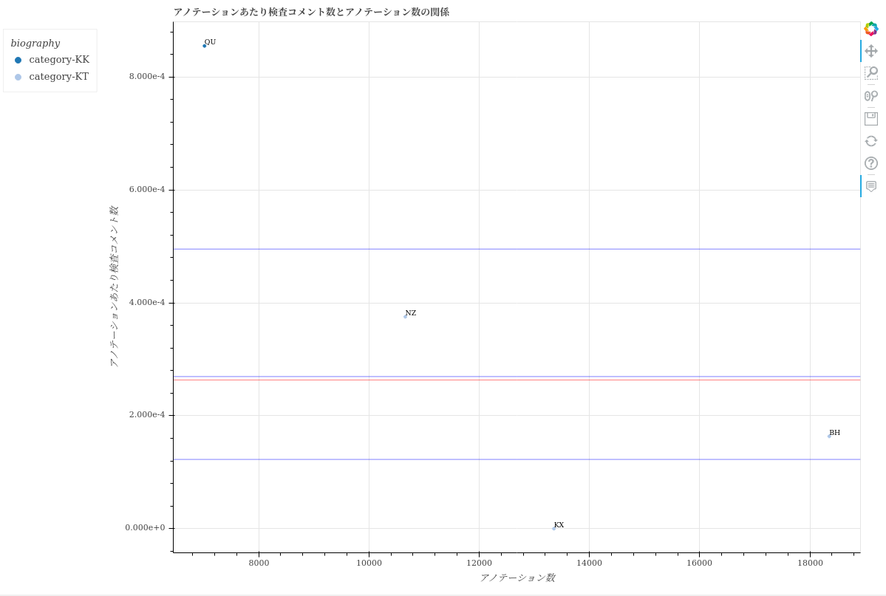

==============================================================================================================================
scatter/散布図-教師付者の品質と作業量の関係.html
==============================================================================================================================

品質と累計作業時間の関係を、ユーザごとにプロットした散布図です。
グラフのデータは :doc:`メンバごとの生産性と品質_csv` を参照しています。

`散布図-教師付者の品質と作業量の関係.html <https://kurusugawa-computer.github.io/annofab-cli/command_reference/statistics/visualize/out_dir/scatter/%E6%95%A3%E5%B8%83%E5%9B%B3-%E6%95%99%E5%B8%AB%E4%BB%98%E8%80%85%E3%81%AE%E5%93%81%E8%B3%AA%E3%81%A8%E4%BD%9C%E6%A5%AD%E9%87%8F%E3%81%AE%E9%96%A2%E4%BF%82.html>`_

