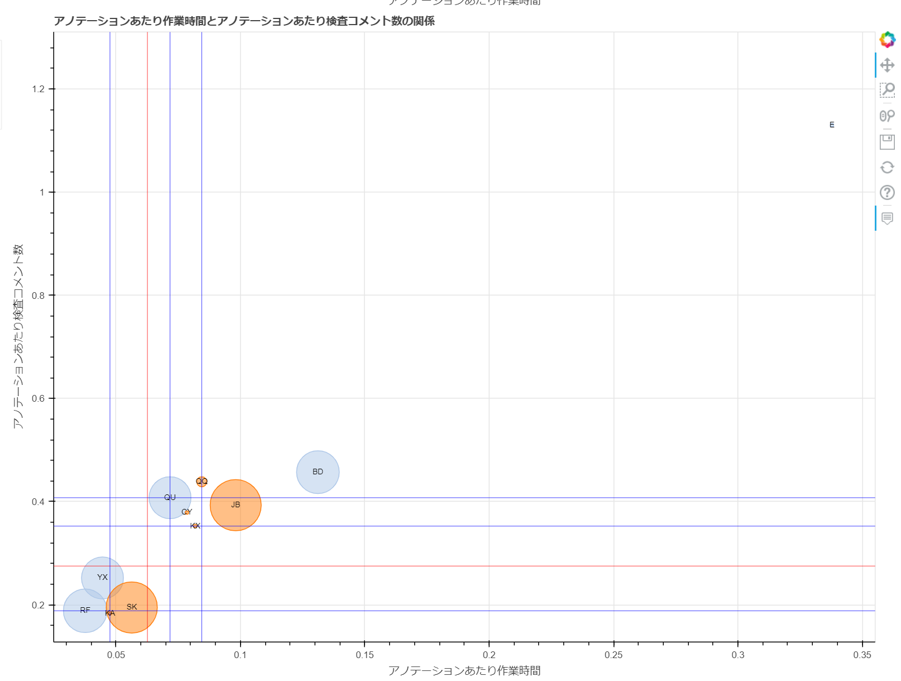

==============================================================================================================================
scatter/散布図-生産量あたり作業時間と品質の関係-教師付者用.html
==============================================================================================================================

生産性の指標である「生産量あたり作業時間」と、品質の指標をプロットした散布図です。
円の大きさは累計作業時間の大きさを表しています。

HTML上の「生産量種別」で、アノテーション、入力データ、カスタム生産量を切り替えられます。
また、「作業時間種別」で、実績時間と計測時間を切り替えられます。実績時間が存在する場合は、初期表示は実績時間です。

グラフのデータは :doc:`メンバごとの生産性と品質_csv` を参照しています。

