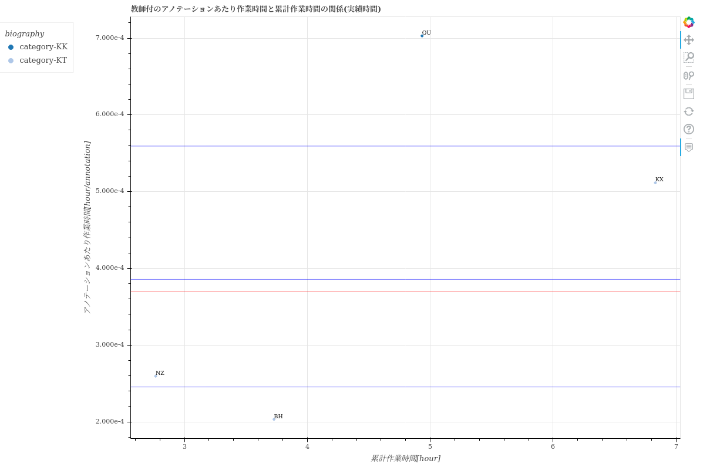

==============================================================================================================================
scatter/散布図-生産量あたり作業時間と累計作業時間の関係.html
==============================================================================================================================

生産性の指標である「生産量あたり作業時間」と累計作業時間の関係を、ユーザごとにプロットした散布図です。
グラフのデータは :doc:`メンバごとの生産性と品質_csv` を参照しています。

グラフから、ユーザごとの生産性や経験値（累計作業時間）が分かります。

HTML上の「生産量種別」で、アノテーション、入力データ、カスタム生産量を切り替えられます。
また、「作業時間種別」で、実績時間と計測時間を切り替えられます。実績時間が存在する場合は、初期表示は実績時間です。

.. note::

    累計作業時間が小さいユーザーは、作業に慣れていないため生産性の信頼性が低いです。
    ユーザーの生産性を比較する場合は、「累計作業時間が一定値を超えているユーザー」で評価することを推奨します。
