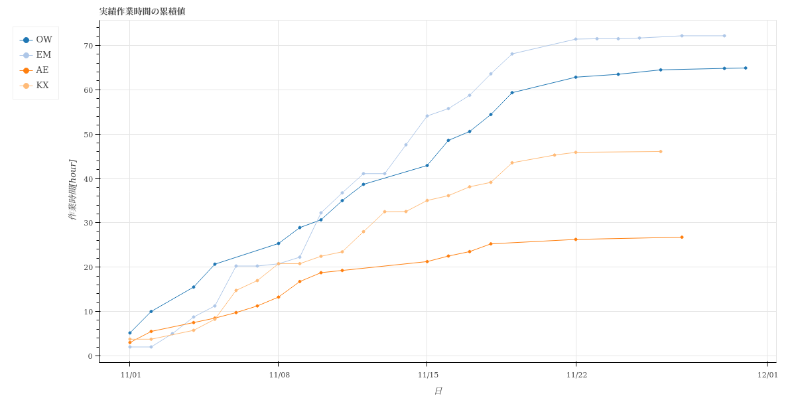

====================================================================================
line-graph/累積折れ線-横軸_日-縦軸_作業時間.html
====================================================================================

日毎の累積作業時間を、ユーザごとにプロットした折れ線グラフです。
対象ユーザの、ある時点での経験値（累積作業時間）が分かります。

グラフのデータは :doc:`ユーザ_日付list-作業時間_csv` を参照しています。

`累積折れ線-横軸_日-全体.htmlのサンプル <https://kurusugawa-computer.github.io/annofab-cli/command_reference/statistics/visualize/out_dir/line-graph/累積折れ線-横軸_日-縦軸_作業時間.html>`_
