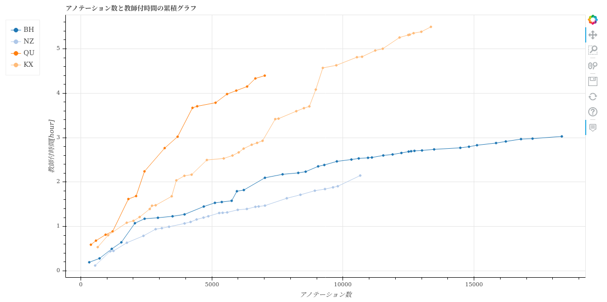
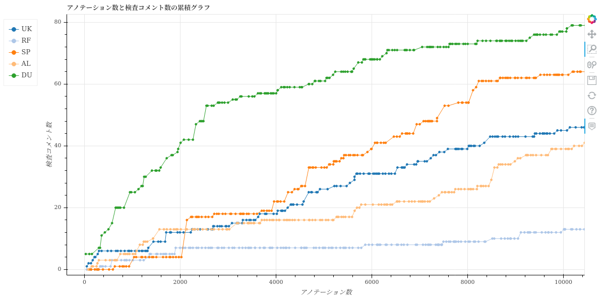

====================================================================================
line-graph/{phase}/累積折れ線-横軸_生産量-{phase}者用.html
====================================================================================

作業したタスクに含まれている生産量の累積値と、作業時間などの累積値をタスクごとにプロットした折れ線グラフです。
フェーズごとにhtmlファイルは出力されます。
生産量種別は、HTML内のセレクトボックスで切り替えられます。

グラフのデータは :doc:`task-worktime-list-by-user-phase_csv` を参照しています。

このグラフでは、ユーザーごとの生産性と品質の習熟傾向を確認できます。

`累積折れ線-横軸_生産量-教師付者用.htmlのサンプル <https://kurusugawa-computer.github.io/annofab-cli/command_reference/statistics/visualize/out_dir/line-graph/累積折れ線-横軸_生産量-教師付者用.html>`_

.. note::

    複数人で同じあタスクの同じフェーズを作業した場合、ユーザーごとの作業時間で按分した値を生産量や指摘数として算出します。
    たとえば、task1の教師付フェーズの作業にユーザーAが45分、ユーザーBが15分かかったとします。その場合、「ユーザーAはtask1を0.75個、ユーザーBはtask1を0.25個のタスクを作業した」とみなします。
    

生産性の習熟傾向を表すグラフ
====================================================================================

以下のグラフは、作業したタスクに含まれているアノテーション数の累積値と、教師付作業時間の累積値をプロットした折れ線グラフです。
折れ線の傾きは生産性を表しています。
生産性が高いほど、グラフの傾きは小さくなります。

品質の習熟傾向を表すグラフ
====================================================================================

以下のグラフは、作業したタスクに含まれているアノテーション数の累積値と、検査コメント数（指摘を受けたコメントの数）の累積値をプロットした折れ線グラフです。
教師付フェーズの作業の品質を評価できます。
教師付の品質が高いほど、グラフの傾きは小さくなる傾向にあります。

.. note::

    1個のタスクに同じ内容の指摘を複数回受けた場合、本来の品質より悪く評価される場合があります。
    また軽微な指摘も重大な指摘も「同じレベルの指摘」として扱っているため、正しく品質を評価するには、指摘の中身まで確認した方が良い場合もあります。

