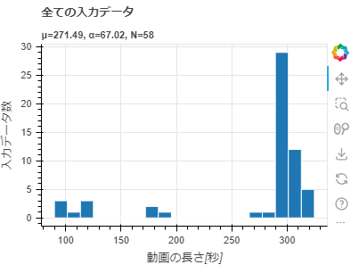
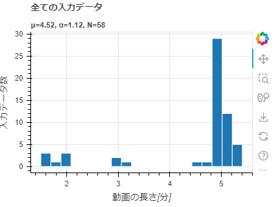
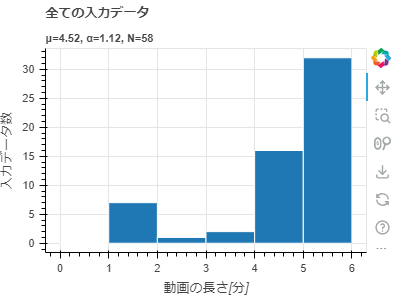

==========================================
statistics visualize_video_duration
==========================================

Description
=================================

動画の長さをヒストグラムで可視化します。

Examples
=================================

.. code-block::

    $ annofabcli statistics visualize_video_duration --project_id prj1 --output out.html

下図は `out.html <https://kurusugawa-computer.github.io/annofab-cli/command_reference/statistics/visualize_video_duration/output/out.html>`_ の中身です。

デフォルトでは、動画の長さは「秒」単位で表示されます。「分」単位で表示する場合は、 ``--time_unit minute`` を指定してください。

.. code-block::

    $ annofabcli statistics visualize_video_duration --project_id prj1 --output out2.html \
    --time_unit minute

``--bin_width`` を指定するとビンの幅を「秒」単位で指定できます。以下のコマンドはビンの幅を60秒（1分）にしています。

.. code-block::

    $ annofabcli statistics visualize_video_duration --project_id prj1 --output out3.html \
    --time_unit minute --bin_width 60

Usage Details
=================================

.. argparse::
   :ref: annofabcli.statistics.visualize_video_duration.add_parser
   :prog: annofabcli statistics visualize_video_duration
   :nosubcommands:
   :nodefaultconst:
